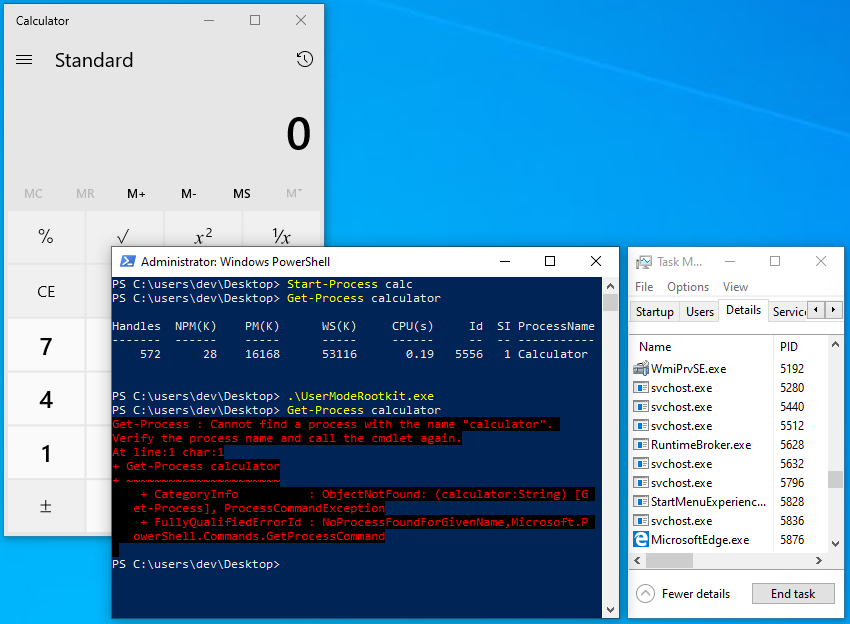

# Rogue
The purpose of this project is to experiment with rootkit techniques for educational purposes.

## User mode rootkit

### Features

- Attempts to elevate to SYSTEM for access to processes like Taskmgr.exe
- Can hook native functions (inline)
- Injects shellcode rather than a module

### Limitations

- Uses CreateRemoteThread (loud)
- Does not support unhooking
- Does not invoke syscall from ntdll
